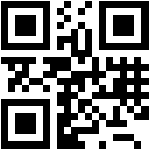

# FredBot


## Description

Introducing Fred Bot, your Discord companion leveraging the power of Node.js and Discord.js to seamlessly integrate advanced features into your server. 
Fred Bot provides real-time weather updates for any global location with a straightforward command, offering users a quick and efficient way to stay informed. Additionally, Fred Bot enhances link sharing within your server by generating QR codes instantly, promoting effective communication. With a robust foundation built on Node.js and Discord.js, Fred Bot ensures a reliable, user-friendly experience, making it the definitive choice for those seeking a blend of utility and engagement in their Discord interactions. 


## Screenshots




## Links

- Repository URL: [Here]()
- Live Site URL: [Here]()


## Features
+ Weather Updates: Obtain real-time weather information for any location worldwide with a simple command.

+ QR Code Generation: Quickly generate QR codes for shared links, adding an interactive element to your Discord conversations.

+ User-Friendly Interface: Fred Bot offers an intuitive and user-friendly interface, making it easy for users to access its features.


## Usage/Examples

On Discord server with bot active use slash commands to control bot

```text
/weather city
```
```text
/weather tampa 
```
Returns
```text
Hello user,
                The weather in tampa is 71° with a min of 68° and a max of 73. 
                You should expect overcast clouds ☁️.
```
* Returns current weather data including current temperature and weather conditions
* replace city keyword with any valid North American city name

```text
/qr your-link-here
```
```
/qr www.google.com
```
Returns a qr code img of the link or text

## API Reference

#### Get all items

```http
  GET http://api.openweathermap.org/geo/1.0/direct?q=London&limit=5&appid={API key}
```

| Parameter | Type     | Description                |
| :-------- | :------- | :------------------------- |
| `api_key` | `string` | **Required**. Your API key |

#### Get item

```http
  GET https://api.qrserver.com/v1/create-qr-code/?size=150x150&data=${url}
```

| Parameter | Type     | Description                       |
| :-------- | :------- | :-------------------------------- |
| `id`      | `string` | **Required**. Id of item to fetch |


## Tech Stack


## Lessons Learned

While building this project, we've gained an understanding of the Discord.js environment, mastering the integration of Discord's features to enhance our bot, Fred Bot. Handling GET requests has sharpened our skills in making HTTP requests and parsing data for real-time information, while delving into Node.js syntax has equipped us to build an efficient backend for our bot. Asynchronous programming in Node.js has become second nature, allowing our bot to handle multiple tasks simultaneously. This project has provided a comprehensive understanding of Discord.js, GET requests, Node.js syntax, and asynchronous functions, offering a solid foundation for developing dynamic applications within the Discord environment. 


## Authors

- [Cole Joffray](https://github.com/colejoffray)
- [Jasmine Taylor](https://github.com/codewithjazzy)
- [Samuel Khong](https://github.com/samuelkhong)

